# Hotel Covid - Desktop Environment

The docker platform has a fully functional desktop service based on [Duing](https://github.com/kairops/docker-ubuntu-xrdp-mate-custom/tree/master/duing) project, with an ubuntu 19.04 fully functional and:

- Chromium browser
- Firefox browser
- Intellij IDE

Once the docker dev env is "up and running" use a RDP client to connect to the dockerized desktop.

- For Windows, use build-in "Remote Desktop Environment" application.
- For Mac, use "Microsoft Remote Desktop" application. It can be found in the App Store.
- For Linux, use "Remmina".

Open a connection to:

- Host/port: localhost:3389
- User: ubuntu
- Password: ubuntu

1. Access with RDP to the Ubuntu MATE desktop

    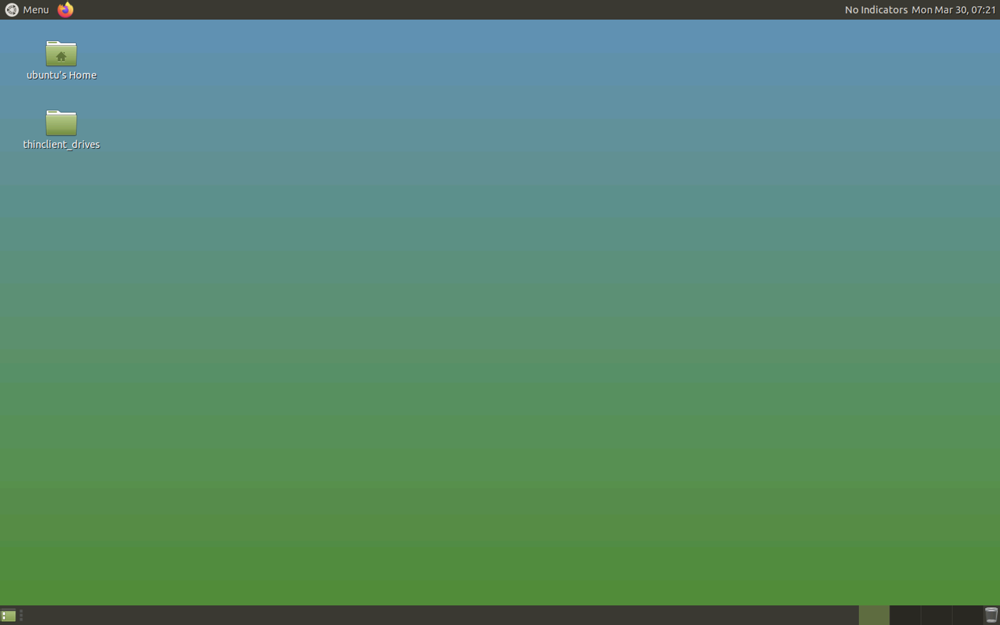

    You can open a browser and point it to <http://app;:8080> to view the app running

    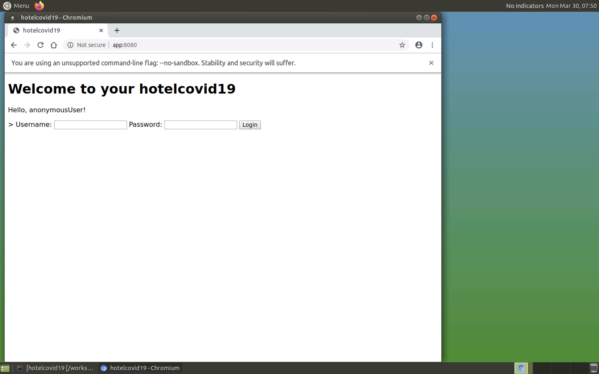

2. Open the IntelliJ IDE located on the menu in the upper left corner

    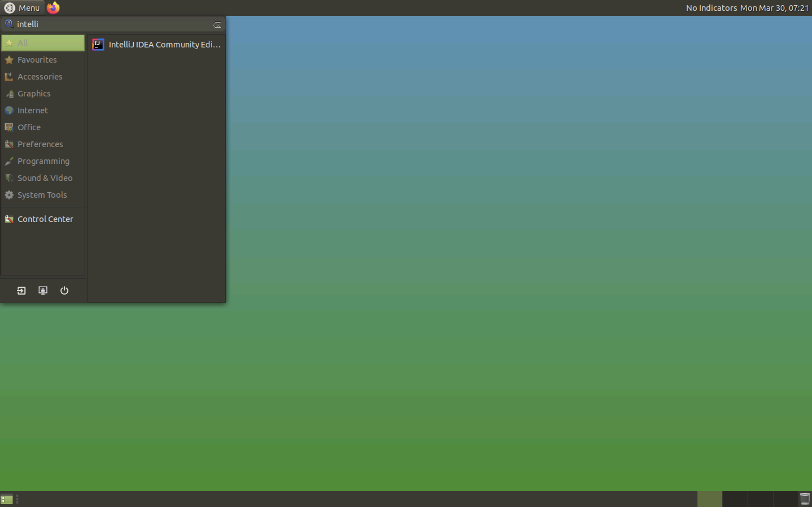

3. Accept the Jetbrains Private Policy license

    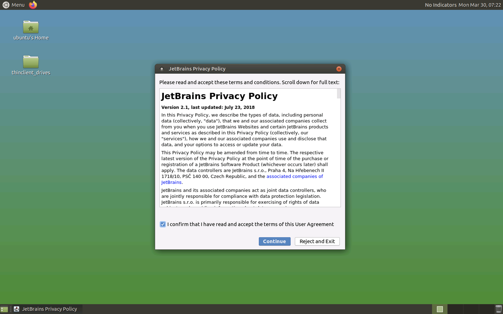

4. Wait for the IDE to start

    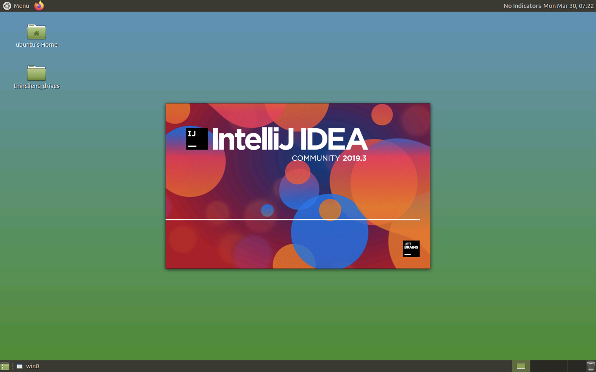

5. Click on "Import" project

    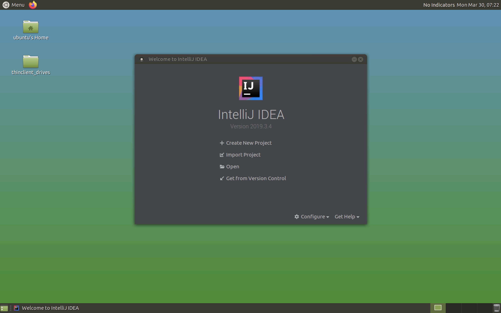

6. Select "/workspace" directory of the system

    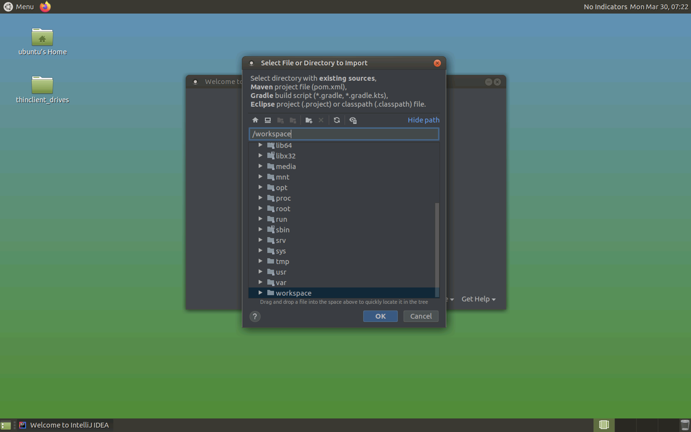

    Note that this directory of the container is connected to your workstation file system using a docker volume, so you can find the source code here

7. Import the project iusing a Maven model

    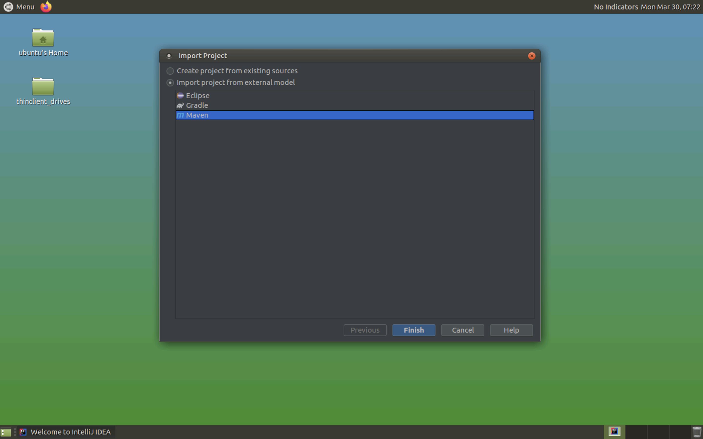

8. Wait for the IDE for the initial warmup

    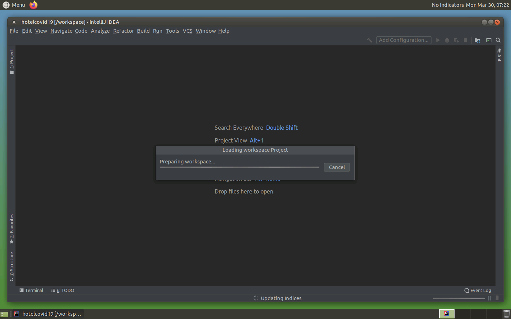

9. Add a new remote debugging configuration

    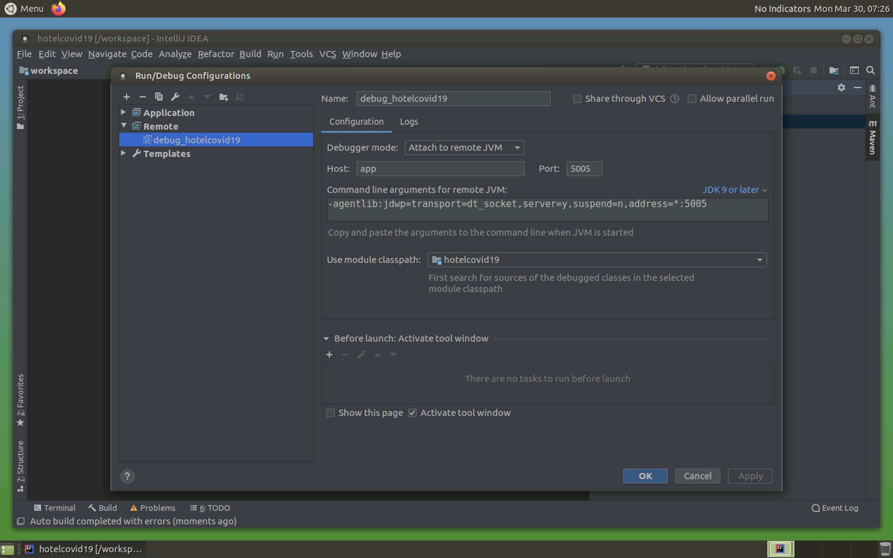

10. Add a new application configuration (it's not yet verified)

    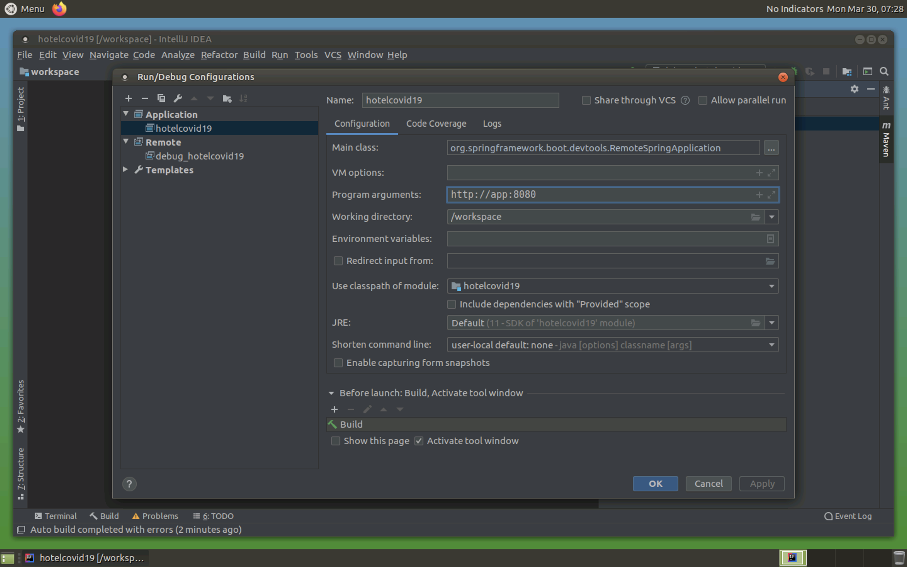

11. Click on the debug icon on the upper right corner of the IDE

    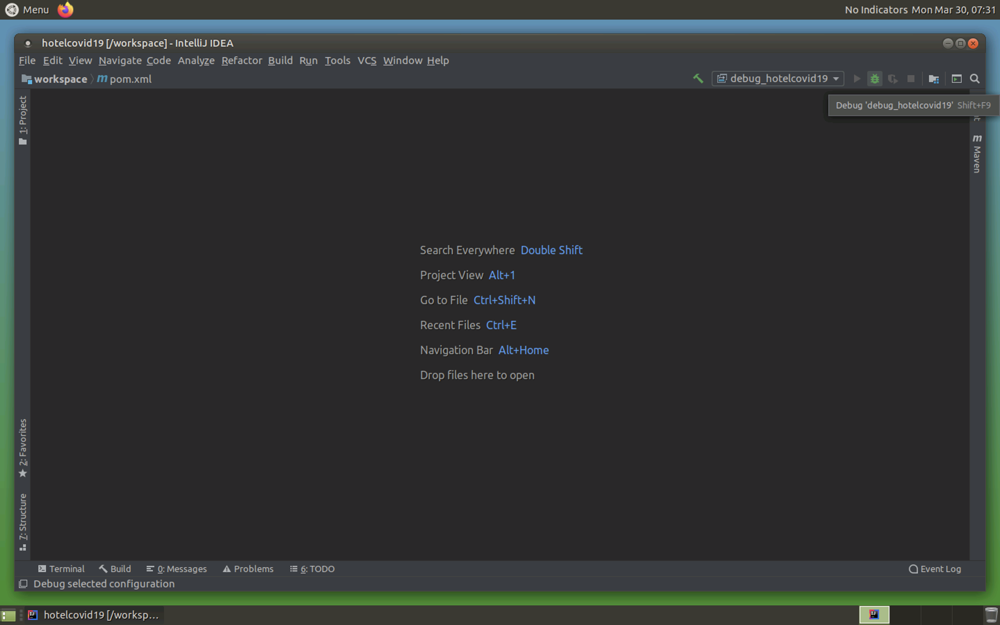

12. Check that you are connected to the remote app

    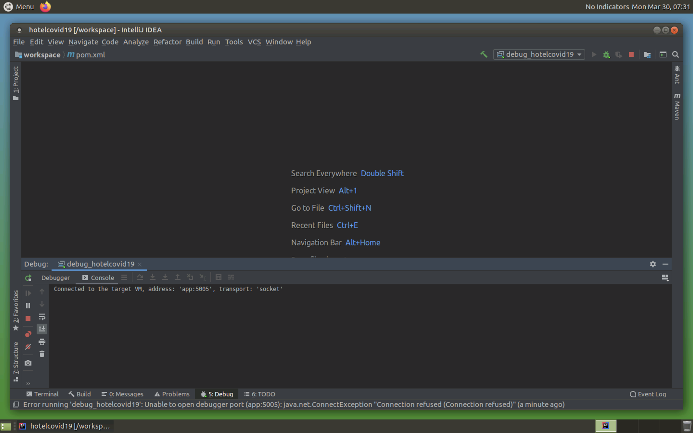
